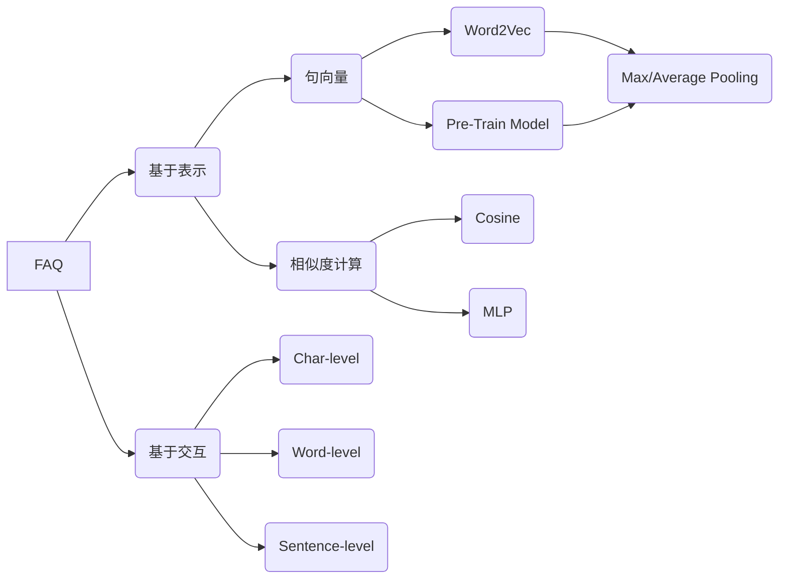

# FAQ

## 概念

FAQ（Frequently Asked Question），检索式问答系统，给定 FAQ 候选集（即 Q-A 对），用户输入 query，需要返回最相似问题的答案

具体的方法可以分为 q-Q 相似度计算，即将 query 与候选集中问题匹配；以及 q-A 相关度匹配，即将 query 与候选集中答案匹配；一般前者应用更广泛

[FAQ Retrieval using Query-Question Similarity and BERT-Based Query-Answer Relevance](https://arxiv.org/pdf/1905.02851.pdf)

FAQ 属于文本匹配任务（区别于文本分类任务），相关模型可以分为两类

其一为基于表示的相似度模型，即先对句子进行向量表示（如 Word2Vec，BERT 编码等）获得句向量，然后进行相似度计算（如 余弦相似度，Dense + Softmax 分类）

其二为基于交互的相似度模型，直接对两个句子进行多个维度的编码，然后计算相似度，即使用各种 Attention 机制（如 BERT）

## 资源

~~[谈谈文本匹配和多轮检索](https://zhuanlan.zhihu.com/p/111769969)~~

[[NLP] 远离送命题: 问答系统中语义匹配的『杀手锏』](https://zhuanlan.zhihu.com/p/112562420) ，[DataTerminatorX/Keyword-BERT](https://github.com/DataTerminatorX/Keyword-BERT)

[PolyEncoder-Facebook的全新信息匹配架构-提速3000倍(附复现结果与代码)  ](https://zhuanlan.zhihu.com/p/119444637) ，[ParlAI/Poly-Encoder](https://parl.ai/projects/polyencoder/)

[Chinese-Text-Classification-Pytorch](https://github.com/649453932/Chinese-Text-Classification-Pytorch) ，中文文本分类，TextCNN，TextRNN，FastText，TextRCNN，BiLSTM_Attention，DPCNN，Transformer，基于pytorch，开箱即用。

[brightmart/text_classification](https://github.com/brightmart/text_classification) ，all kinds of text classification models and more with deep learning

[kk7nc/Text_Classification](https://github.com/kk7nc/Text_Classification) ，Text Classification Algorithms: A Survey

[facebookresearch/fastText](https://github.com/facebookresearch/fastText)，Library for fast text representation and classification.

~~[文本匹配相关方向打卡点总结（数据，场景，论文，开源工具） - 夕小瑶的文章 - 知乎 ](https://zhuanlan.zhihu.com/p/87384188)~~

[NTMC-Community/MatchZoo](https://github.com/NTMC-Community/MatchZoo) ，Facilitating the design, comparison and sharing of deep text matching models.（[介绍](https://zhuanlan.zhihu.com/p/94085483) ，[流程](https://zhuanlan.zhihu.com/p/98180757)）

~~[baidu/AnyQ](https://github.com/baidu/AnyQ) ， FAQ-based Question Answering System~~

[基于深度学习的FAQ问答系统](https://cloud.tencent.com/developer/article/1196826)

